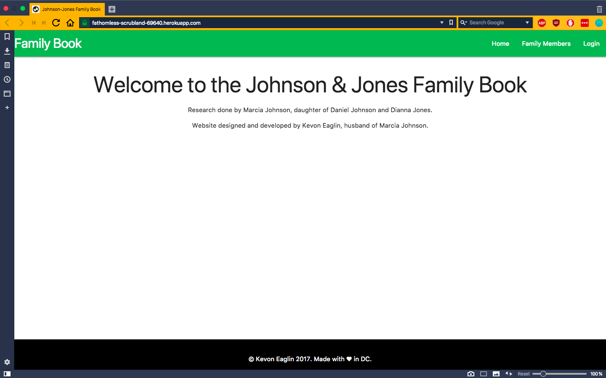
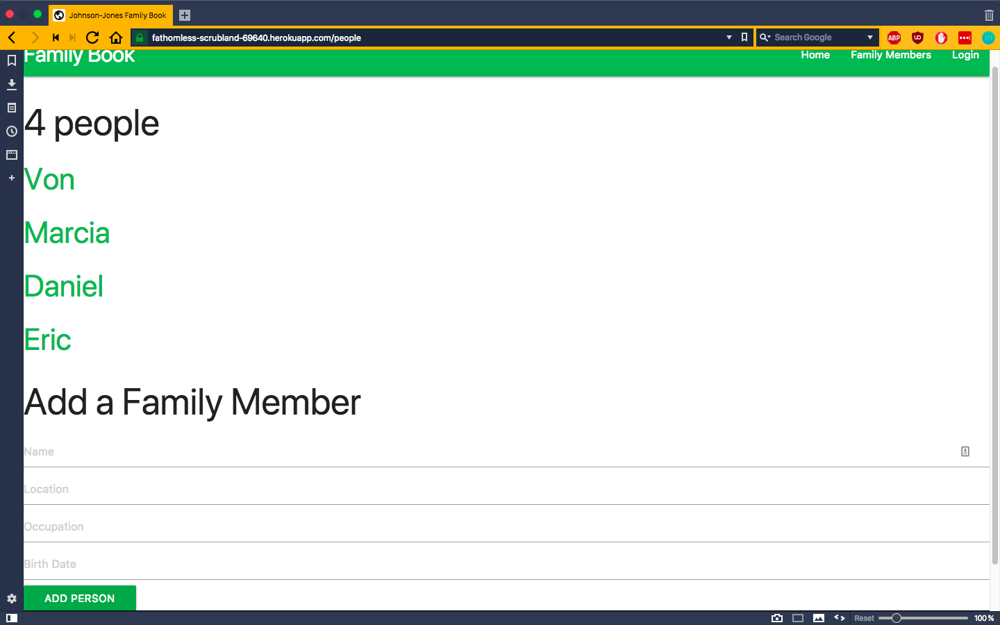
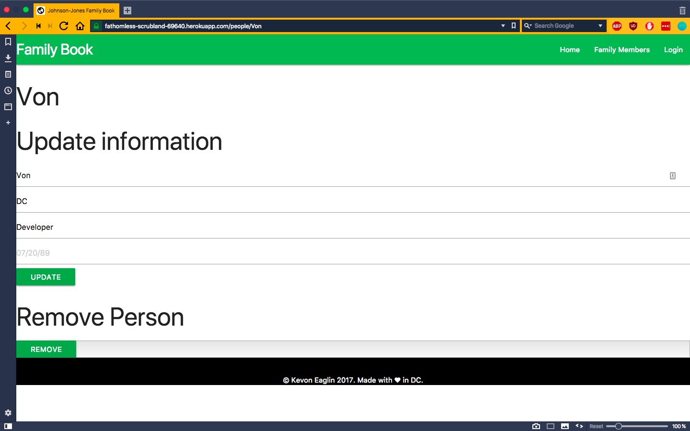

# WDI20 Project 2
### Johnson and Jones Family Book
An application that aggregates and displays family and ancestry data.

## Project Status
This project is still being actively developed. 
- Need a place to display an image (or carousel of images)
- Better form and view separation
- Form data verification

#### Stack
- Node  
- ExpressJS  
- MongoDB  
- Handlebars  
Data modeled with MongooseJS  
Deployed to Heroku
Cloud DB set up with mLab

#### Resources
- [codrops](https://tympanus.net/codrops/css_reference/)  
- [Materialize](http://next.materializecss.com/)  
- [whenpresident](https://github.com/keaglin/whenpresidentexercise) (from following in class)  

## Project Screen Shots

## Usage Instructions
#### Prerequisites
You will need `node` and `npm` installed globally on your machine.  
#### Install and Setup
1. Clone down this repository  
2. Run `npm install`  
3. Start Server with `npm start`   
4. Visit App at `localhost:3001`  

## Reflection

#### About 
This was a project built over 3 days to wrap up Unit 2 of my Web Development Immersive cohort at General Assembly DC. I built it to demonstrate knowledge of backend engineering techniques learned during Unit 2.  
I initially set out to build an API with a separate frontend. The project was inspired by my wife's idea to make and bind a physical book. I thought a website would make the information more accessible and easier to disseminate.  
#### Technologies Used
I used the MEHN (Mongo, Express, Handlebars, Node) stack to build this project because it's what we've been using so it was easy to translate to my use case for this project. I initially wanted to use Pug because I had positive experiences with Pug (when it was Jade) in the past but I severely underestimated how much time I spent reading documentation and experimenting to get things functional, especially with regard to passing in data from my controller. With the time given, I decided to switch back to Handlebars because I could accomplish the same functionality and hit my deadline.  
We previously deployed to Github Pages but were directed to use Heroku this time. Github Pages is excellent for static sites but we needed a backend for this particular project so Heroku was an easy choice. We used mLab for our cloud database and used an environmental variable to connect it.  
#### Obstacles
When I set out, I thought translating what I knew from lessons and practice (some guided, some not) would take only about a day but I had trouble time-wise with Pug as well as conceptually. I couldn't find clear information regarding passing in data from the controller. Which is fine. I switched to Handlebars but then it took me longer than expected to make sure I was employing the right routes and HTTP verbs. 